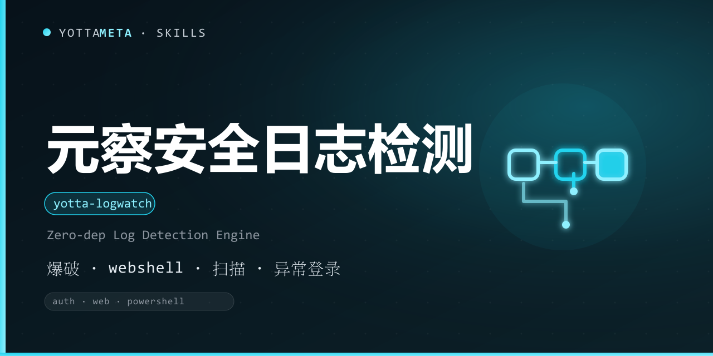

<p align="center"><b>语言 / Language</b>：中文（本文件）· <a href="./README.md">English</a></p>

<p align="center">
  
</p>

<h1 align="center">yotta-logwatch · 元察</h1>

<p align="center">YottaMeta 自有的零依赖安全日志分析检测引擎：<b>登录爆破 · Web 攻击扫描 · 可疑 PowerShell 脚本块</b>，纯 Python 3.8+ 标准库实现，只读本地日志、离线检测、输出中文教学报告。适用于安全测试排查、应急响应、审计日志、红蓝对抗复盘等需要分析本地日志、定位可疑活动的场景。</p>
<p align="center">检测到分析登录 / Web 访问 / PowerShell 日志、排查入侵痕迹、审计异常活动 等意图时自动激活——<b>只读本地，不主动扫描、不联网、不改动日志</b>。</p>
<p align="center">不依赖任何外部工具；Windows + Linux + macOS 通用；输出时间线与命中规则的中文说明。</p>

<p align="center">
  <a href="LICENSE"></a>
  <a href="https://agentskills.io/"></a>
  <a href="https://www.npmjs.com/package/@yottameta/yotta-logwatch"></a>
  <a href="https://github.com/YottaMeta/yotta-logwatch"></a>
  <a href="https://github.com/YottaMeta/yotta-logwatch/commits/main"></a>
  <a href="https://github.com/YottaMeta/yotta-logwatch"></a>
</p>

## 这是什么

安全排查往往从日志开始：登录日志里有没有爆破、Web 访问日志里有没有扫描 / webshell 上传、PowerShell 脚本块有没有可疑命令。元察把这些能力做成零依赖的自研引擎——不依赖 SIEM / 外部工具，纯 Python 标准库即可解析 auth/secure、Web 访问日志（common/combined）、PowerShell 脚本块日志、Windows 事件日志（Security/System），并按启发式规则圈出可疑活动，输出带中文教学说明的时间线与报告。

它不是一个平台专属功能，而是一份与智能体无关的工具包：装进任何支持 Agent Skills 的智能体即可按需调用。**只读本地日志**，不联网、不主动扫描、不修改任何日志内容，也不需要常驻服务。

## 核心价值

- **零依赖自研**：四类日志解析 + 检测规则全部用 Python 3.8+ 标准库实现，不依赖 SIEM / 外部扫描器。
- **四类日志覆盖**：auth/secure（爆破 / 异常登录 / sudo 提权）、Web 访问日志（扫描 / webshell / 遍历 / SQLi / 可疑 UA）、PowerShell 脚本块（编码 / 下载执行 / 反射 / AMSI 绕过 / 混淆）、Windows 事件日志（登录失败 / 异常登录 / 账户操作 / 日志清空 / 可疑进程）。
- **类型自动嗅探**：无需手动指定日志类型，按行特征自动判断；也可 `--type` 强制。
- **时间线 + 中文说明**：命中按时间排序，每条含类型、严重度、证据行、中文说明与复核建议。
- **三种输出**：文本 / JSON（stdout 纯净）/ Markdown 报告；`--output` 可写文件。
- **可调阈值**：爆破次数（--max-fail）、时间窗（--window）、404 洪峰（--404-threshold）均可调。

## 核心优势

| 优势 | 说明 |
|---|---|
| **零依赖** | Python 3.8+ 标准库，无 daemon / 无数据库 / 无外部扫描器；Windows + Linux + macOS 通用 |
| **只读离线** | 只解析本地日志文件，不联网、不主动扫描、不修改任何其内容 |
| **类型自适应** | 无需手动指定日志类型，自动嗅探 auth / web / powershell / winevt |
| **可解释** | 每条命中给出中文说明与复核建议，只提示「可疑」不提供利用细节 |
| **可调阈值** | 爆破 / 时间窗 / 404 洪峰阈值可调，降低噪音 |
| **生态分发** | GitHub + npm + ClawHub 三源同步发布；npx / install.sh / 手动复制三种安装方式 |

## 功能体系

| 能力 | 说明 |
|---|---|
| scan | 解析本地日志并按类型检测，输出文本 / JSON / Markdown 报告 |
| --path / --recursive | 指定日志文件或目录（目录默认只取日志特征文件，可递归） |
| --stdin | 从标准输入读取日志（管道） |
| --type | 强制指定日志类型（auth / web / powershell / winevt） |
| --min-severity | 只显示不低于指定严重度的命中 |
| --json / --report / --format | 输出格式切换（text / json / markdown） |
| --version | 显示版本 |

## 快速使用

Windows 用 python，Linux/macOS 用 python3。

```bash
# 分析本地 auth 日志
python3 scripts/yotta_logwatch.py scan --path /var/log/auth.log

# 递归扫描目录下所有日志特征文件，输出 Markdown 报告
python3 scripts/yotta_logwatch.py scan --path /var/log/nginx --recursive --report report.md

# 强制指定日志类型为 Web
python3 scripts/yotta_logwatch.py scan --path access.log --type web

# 只显示 medium 及以上严重度
python3 scripts/yotta_logwatch.py scan --path auth.log --min-severity medium

# 调低爆破阈值 / 时间窗
python3 scripts/yotta_logwatch.py scan --path auth.log --max-fail 3 --window 120

# 从标准输入读取（管道）
type auth.log | python scripts/yotta_logwatch.py scan --stdin

# 查看版本
python3 scripts/yotta_logwatch.py --version
```

退出码：**0** = 无命中；**1** = 有命中；**4** = 用法或读取错误。

## 与 AI 智能体配合使用

1. 把本仓库的 SKILL.md 接入任意智能体的 skills / rules 系统（见下方「安装」）。
2. 用户问「auth 日志里有没有爆破？」时，运行：

```bash
python3 scripts/yotta_logwatch.py scan --path /var/log/auth.log
```

   即可得到按时间排序的命中：类型、严重度、证据行、中文说明与复核建议。
3. 只关注高价值命中时，按严重度过滤：

```bash
python3 scripts/yotta_logwatch.py scan --path auth.log --min-severity high
```

4. 需要机器可读输出时用 --json（stdout 纯净），便于管道集成。
5. 所有命中一律当作「可疑提示」人工复核，不自动判定为攻击。

## 安装

三种方式任选其一，技能文件统一从 **npm** 获取（GitHub 无代理时较慢，npm 可配国内镜像加速）。

### 方式一：npm（推荐，一行安装）
```bash
# 国内加速（可选）：npm config set registry https://registry.npmmirror.com
npx -y @yottameta/yotta-logwatch -g
npx -y @yottameta/yotta-logwatch --dir <你的技能目录>   # 任意智能体：指定目录安装
```
> 智能体不在预置列表里？用 --dir 指定它的 skills 目录，或手动复制（方式三）。--list 可查看各智能体对应的默认目录。想手动拿文件也可 npm pack @yottameta/yotta-logwatch 解包后按方式二/三安装。

### 方式二：install.sh 一键安装
获取技能文件夹后（npm pack 解包或 git clone），进入技能文件夹：
```bash
bash install.sh -g    # 用户级；bash install.sh --list 查看全部目录
bash install.sh --agent codex   # 指定智能体（--list 可查看可用项）
bash install.sh       # 项目级：自动检测已存在的 .claude/.cursor/.codex 等 skills 目录
bash install.sh --dir /path/to/skills
```
> 覆盖多类智能体，含国内 Trae / Qwen / Comate / CodeBuddy / Kimi。Windows 用户：装有 Git Bash 即可用；否则用方式三手动复制。

### 方式三：手动复制
把整个 yotta-logwatch 文件夹复制到目标智能体的 skills 目录。常见位置（用户级；Windows 用 %USERPROFILE%，Linux/macOS 用 ~）：

| 智能体 | 用户级目录 | 项目级目录 |
|---|---|---|
| Codex | %USERPROFILE%\.codex\skills\yotta-logwatch\ | .codex\skills\ |
| Claude Code | %USERPROFILE%\.claude\skills\yotta-logwatch\ | .claude\skills\ |
| Cursor | %USERPROFILE%\.cursor\skills\yotta-logwatch\ | .cursor\skills\ |
| Windsurf | %USERPROFILE%\.codeium\windsurf\skills\yotta-logwatch\ | .windsurf\skills\ |
| opencode | %USERPROFILE%\.config\opencode\skills\yotta-logwatch\ | .opencode\skills\ |
| Gemini | %USERPROFILE%\.gemini\skills\yotta-logwatch\ | .gemini\skills\ |
| Goose | %USERPROFILE%\.config\goose\skills\yotta-logwatch\ | .goose\skills\ |
| Amp | %USERPROFILE%\.config\agents\skills\yotta-logwatch\ | .agents\skills\ |
| Kiro | %USERPROFILE%\.kiro\skills\yotta-logwatch\ | .kiro\skills\ |
| WorkBuddy | %USERPROFILE%\.workbuddy\skills\yotta-logwatch\ | .workbuddy\skills\ |
| Trae Code CLI | %USERPROFILE%\.traecli\skills\yotta-logwatch\ | .traecli\skills\ |
| Trae IDE（国内） | %USERPROFILE%\.trae-cn\skills\yotta-logwatch\ | .trae\skills\ |
| Qwen Code | %USERPROFILE%\.qwen\skills\yotta-logwatch\ | .qwen\skills\ |
| Comate | %USERPROFILE%\.comate\skills\yotta-logwatch\ | .comate\skills\ |
| CodeBuddy | %USERPROFILE%\.codebuddy\skills\yotta-logwatch\ | .codebuddy\skills\ |
| Kimi | %USERPROFILE%\.kimi\skills\yotta-logwatch\ | .kimi\skills\ |
| 通用 AGENTS.md | %USERPROFILE%\.agents\skills\yotta-logwatch\ | .agents\skills\ |

> Codex 默认目录若设置了环境变量 CODEX_HOME，以该变量为准；opencode 若设置 XDG_CONFIG_HOME 同理。.agents\skills 并非通用目录，仅 OpenCode / Cursor / Cline / Amp / Kimi / Gemini CLI / GitHub Copilot 等会读取，**Claude Code 与 Codex 默认不读**。不确定时用 --dir 指定，或让该智能体自行安装。

## 升级 / 卸载

- **升级**：重新安装最新版覆盖即可——npx -y @yottameta/yotta-logwatch -g 或重跑 bash install.sh -g。技能目录内的旧文件会被覆盖；不影响项目中已有的其他文件。
- **卸载**：删除目标智能体 skills 目录下的 yotta-logwatch 文件夹（各智能体目录见上表）即可。卸载后本技能不再生效。

## 常见问题

- **会主动扫描或联网吗？** 不会。元察只解析你给到的本地日志文件；不联网、不主动扫描、不修改或删除任何日志内容。
- **会误报吗？** 所有检测均为启发式「可疑提示」，命中只说明「值得人工复核」，不自动判定为攻击；建议结合上下文核实。
- **能分析哪些日志？** auth/secure（sshd / login / sudo）、Web 访问日志（nginx/apache common|combined）、PowerShell 脚本块日志（Event 4104/4103、CommandInvocation、ScriptBlockText 等）、Windows 事件日志（Security/System：登录 4624/4625、账户操作 4720/4726/4740、进程创建 4688、日志清空 1102、服务 7045、计划任务 4698；支持 key=value / wevtutil 文本 / XML 导出）。
- **合规吗？** 仅用于已获明确授权 / 自有资产 / CTF 靶场 / 教学环境的安全审计。未经授权分析他人系统数据违反法律，使用者自行承担责任。
## 检测规则一览

| 类别 | 命中类型 | 严重度 | 说明 |
|---|---|---|---|
| auth | brute_force | low~high | 同源多次失败登录（--max-fail 阈值） |
| auth | credential_stuffing | high | 同源尝试多个不同用户名 |
| auth | abnormal_login | high | 同源多次失败后成功登录 |
| auth | root_login | medium | 来源以 root 直登 |
| auth | sudo_escalation / sudo_attempt | medium~high | sudo 提权 / 越权（not in sudoers） |
| web | path_traversal | high | 路径穿越（../ 或编码变体） |
| web | sql_injection | high | SQL 注入特征 |
| web | webshell_upload | critical | webshell 上传 / 访问轨迹 |
| web | suspicious_ua | low | 已知扫描 / 自动化工具 UA |
| web | scanner_signature | medium | 命中多个管理 / 敏感路径 |
| web | flood_404 | medium | 同源 404 洪峰（--404-threshold 阈值） |
| powershell | encoded_command | high | -EncodedCommand / 长 base64 |
| powershell | download_execute | critical | 下载器 + 远程执行 |
| powershell | reflection | medium | .NET / 内存反射加载 |
| powershell | amsi_bypass | critical | AMSI 绕过字符串 |
| powershell | obfuscation | medium | iex / [char] / 拼接等混淆 |
| winevt | brute_force | low~high | 同源多次 4625 登录失败（--max-fail 阈值） |
| winevt | credential_stuffing | high | 同源 4625 尝试多个用户名 |
| winevt | abnormal_login | high | 同源先 4625 失败后 4624 成功 |
| winevt | rdp_logon / admin_logon | medium | 4624 远程桌面（Type 10）/ 管理员登录 |
| winevt | account_created / account_deleted | high | 4720 账户创建 / 4726 账户删除 |
| winevt | account_locked | medium | 4740 账户被锁定 |
| winevt | group_member_add | medium~high | 4732/4728 组成员添加（管理员组 → high） |
| winevt | audit_log_cleared | critical | 1102 安全日志被清空 |
| winevt | suspicious_process | low~critical | 4688 可疑进程创建（LOLBin / 编码命令等） |
| winevt | service_installed / task_created | medium | 7045 新服务 / 4698 计划任务（持久化） |

## 边界（安全红线）

- **只读本地**：不联网、不主动扫描、不修改 / 删除 / 写入任何日志内容；
- **不提供利用**：所有命中只做「可疑提示 + 复核建议」，不提供利用细节；
- **授权**：仅用于已获明确授权 / 自有资产 / CTF 靶场 / 教学环境的安全审计；未经授权分析他人系统数据违反法律，使用者自行承担责任。

## 开发与校验

- 测试：`python scripts/test_yotta_logwatch.py`（66 项：嗅探 / 解析 / 检测 / 管线 / 输出 / CLI 退出码 0/1/4；在技能目录内运行）
- 规则参考：references/auth-log-rules.md、references/web-log-rules.md、references/powershell-log-rules.md、references/windows-event-rules.md、references/analysis-spec.md

## 更新日志

- v0.2.6（2026-08-27）：发布元数据同步——经 ClawHub 网页后台「New version」重发至 v0.2.6（页面确认展示名「元察 yotta-logwatch」/ slug yotta-logwatch），GitHub + npm 同步升版 0.2.6 保持三源一致；无功能 / 引擎 / 规则变更。
- v0.2.5（2026-08-27）：发布元数据修正——带整体引号 `--name '元察 yotta-logwatch'` 三源重发，确认 ClawHub 卡片展示名为「元察 yotta-logwatch」；无功能 / 引擎 / 规则变更。
- v0.2.4（2026-08-27）：发布元数据修正尝试——`--name 元察 yotta-logwatch` **未加引号**，值被 shell 拆分、`--name` 未生效，ClawHub 卡片展示名仍为裸 `yotta-logwatch`（v0.2.5 修正）；无功能 / 引擎 / 规则变更。
- v0.2.3（2026-08-27）：洁净重发——v0.2.2 tarball 误含 __pycache__ 字节码，0.2.3 清理后重发（内容一致），npm 上已 deprecate 0.2.2。
- v0.2.2（2026-08-27）：文档修正——「开发与校验」移除 `tools/validate-skill.py` 引用（该工具仅存在于 YottaSkills 仓库，不在发布技能包内），只保留技能包内可用的测试脚本。
- v0.2.1（2026-08-27）：文档中英对等补全——中文 README 补齐「与 AI 智能体配合使用 / 检测规则一览 / 边界（安全红线）/ 开发与校验 / 更新日志 / 许可」章节，中英内容一致；无功能变更。
- v0.2.0（2026-08-27）：新增 Windows 事件日志检测（winevt）——解析 Security/System 的 key=value / wevtutil 文本 / XML 导出；4625 爆破聚合、4624 异常 / 管理员 / RDP 登录、账户创建 / 删除 / 锁定、组成员添加、1102 安全日志清空、4688 可疑进程、7045 新服务、4698 计划任务；并落地五块分析规范（references/analysis-spec.md）。66 测试全绿。详见 CHANGELOG.md。
- v0.1.0（2026-08-27）：首版——零依赖引擎解析 auth/secure、Web 访问日志（common/combined）、PowerShell 脚本块，类型自动嗅探；auth / web / powershell 检测；文本 / JSON / Markdown 输出；42 测试全绿。

## 许可

MIT © YottaMeta — 见 [LICENSE](./LICENSE)。
